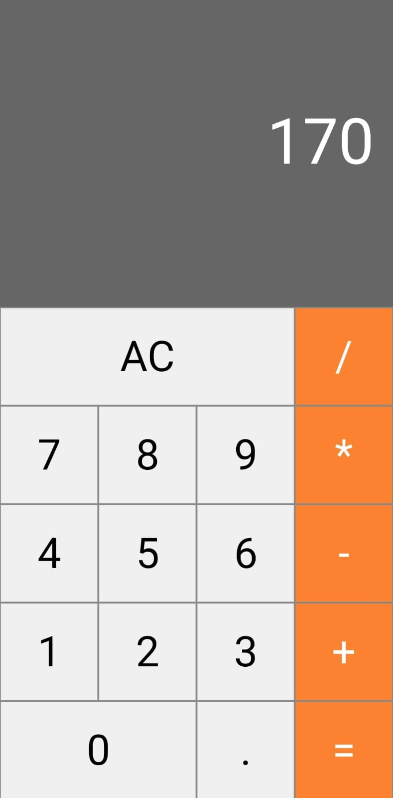

# Calculator 

Discraimer: This project was done through the React Native course from the company Coder available on the Udemy platform.

 
Features: 
1. Calculator perfoms all basics operations
2. Calculator handles floating point numbers